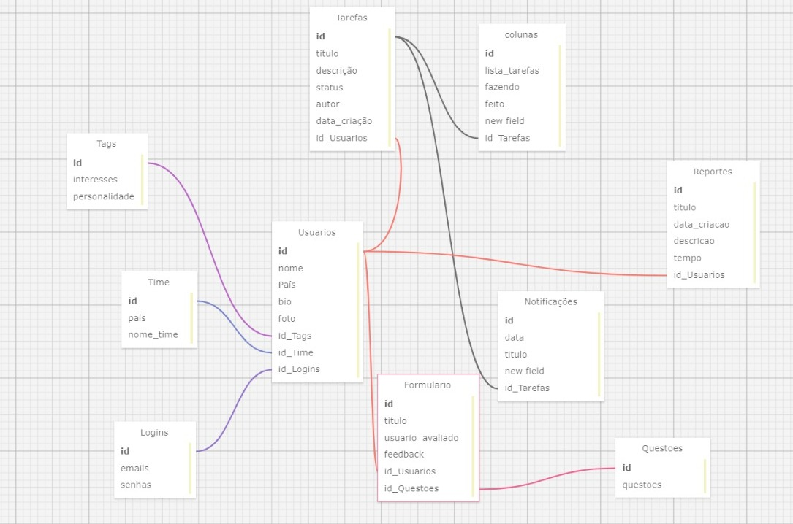

# Atividade Dev Web - David Deodato - Modelo Relacional/Lógico

O modelo relacional é um modelo de dados amplamente utilizado na área de banco de dados.

No modelo relacional, os dados são organizados em tabelas, onde cada tabela representa uma entidade ou um relacionamento entre entidades. Cada tabela é composta por colunas (atributos) e linhas (registros). As colunas representam os diferentes tipos de dados que podem ser armazenados, enquanto as linhas contêm os valores específicos para cada registro.

A importância do modelo relacional na criação de um banco de dados reside em sua capacidade de fornecer uma estrutura organizada e flexível para armazenar e recuperar dados. Algumas das vantagens, como organização lógica, integridade dos dados, flexibilidade e escalabilidade

Após uma breve contextualização, aqui segue minha atividade sobre o modelo relacional relacionado ao projeto 

**Mostragem visual de como ficou:**

<div align="center">
<sub> Banco de dados - Modelo Relacional/Lógico </sub>
<br>
<br>

<br>
<br>
<sup>Fonte: Produzido por David Deodato(2024)</sup>
</div>

**Link para o modelo lógico: https://sql.toad.cz**


Para acessar o arquivo, clique em "SAVE/LOAD", vá em "LOAD" e pesquise "david123"

**OBS:** A contextualização está logo após o código XML

Código XML, como pedido na atividade: 

```
<?xml version="1.0" encoding="utf-8" ?>
<!-- SQL XML created by WWW SQL Designer, https://github.com/ondras/wwwsqldesigner/ -->
<!-- Active URL: https://sql.toad.cz/ -->
<sql>
<datatypes db="mysql">
	<group label="Numeric" color="rgb(238,238,170)">
		<type label="Integer" length="0" sql="INTEGER" quote=""/>
	 	<type label="TINYINT" length="0" sql="TINYINT" quote=""/>
	 	<type label="SMALLINT" length="0" sql="SMALLINT" quote=""/>
	 	<type label="MEDIUMINT" length="0" sql="MEDIUMINT" quote=""/>
	 	<type label="INT" length="0" sql="INT" quote=""/>
		<type label="BIGINT" length="0" sql="BIGINT" quote=""/>
		<type label="Decimal" length="1" sql="DECIMAL" re="DEC" quote=""/>
		<type label="Single precision" length="0" sql="FLOAT" quote=""/>
		<type label="Double precision" length="0" sql="DOUBLE" re="DOUBLE" quote=""/>
	</group>

	<group label="Character" color="rgb(255,200,200)">
		<type label="Char" length="1" sql="CHAR" quote="'"/>
		<type label="Varchar" length="1" sql="VARCHAR" quote="'"/>
		<type label="Text" length="0" sql="MEDIUMTEXT" re="TEXT" quote="'"/>
		<type label="Binary" length="1" sql="BINARY" quote="'"/>
		<type label="Varbinary" length="1" sql="VARBINARY" quote="'"/>
		<type label="BLOB" length="0" sql="BLOB" re="BLOB" quote="'"/>
	</group>

	<group label="Date &amp; Time" color="rgb(200,255,200)">
		<type label="Date" length="0" sql="DATE" quote="'"/>
		<type label="Time" length="0" sql="TIME" quote="'"/>
		<type label="Datetime" length="0" sql="DATETIME" quote="'"/>
		<type label="Year" length="0" sql="YEAR" quote=""/>
		<type label="Timestamp" length="0" sql="TIMESTAMP" quote="'"/>
	</group>
	
	<group label="Miscellaneous" color="rgb(200,200,255)">
		<type label="ENUM" length="1" sql="ENUM" quote=""/>
		<type label="SET" length="1" sql="SET" quote=""/>
		<type label="Bit" length="0" sql="bit" quote=""/>
	</group></datatypes><table x="1902.3333740234375" y="1092.3333129882812" name="Tarefas"><row name="id" null="1" autoincrement="1"><datatype>INTEGER</datatype><default>NULL</default></row><row name="titulo" null="1" autoincrement="0"><datatype>INTEGER</datatype><default>NULL</default></row><row name="descrição" null="1" autoincrement="0"><datatype>INTEGER</datatype><default>NULL</default></row><row name="status" null="1" autoincrement="0">
<datatype>INTEGER</datatype>
<default>NULL</default></row>
<row name="autor" null="1" autoincrement="0">
<datatype>INTEGER</datatype>
<default>NULL</default></row>
<row name="data_criação" null="1" autoincrement="0">
<datatype>INTEGER</datatype>
<default>NULL</default></row>
<row name="id_Usuarios" null="1" autoincrement="0">
<datatype>INTEGER</datatype>
<default>NULL</default><relation table="Usuarios" row="id" />
</row>
<key type="PRIMARY" name="">
<part>id</part>
</key>
</table>
<table x="2133.333251953125" y="1115.3333129882812" name="colunas">
<row name="id" null="1" autoincrement="1">
<datatype>INTEGER</datatype>
<default>NULL</default></row>
<row name="lista_tarefas" null="1" autoincrement="0">
<datatype>INTEGER</datatype>
<default>NULL</default></row>
<row name="fazendo" null="1" autoincrement="0">
<datatype>INTEGER</datatype>
<default>NULL</default></row>
<row name="feito" null="1" autoincrement="0">
<datatype>INTEGER</datatype>
<default>NULL</default></row>
<row name="new field" null="1" autoincrement="0">
<datatype>INTEGER</datatype>
<default>NULL</default></row>
<row name="id_Tarefas" null="1" autoincrement="0">
<datatype>INTEGER</datatype>
<default>NULL</default><relation table="Tarefas" row="id" />
</row>
<key type="PRIMARY" name="">
<part>id</part>
</key>
</table>
<table x="2160.333251953125" y="1481.3333129882812" name="Notificações">
<row name="id" null="1" autoincrement="1">
<datatype>INTEGER</datatype>
<default>NULL</default></row>
<row name="data" null="1" autoincrement="0">
<datatype>INTEGER</datatype>
<default>NULL</default></row>
<row name="titulo" null="1" autoincrement="0">
<datatype>INTEGER</datatype>
<default>NULL</default></row>
<row name="new field" null="1" autoincrement="0">
<datatype>INTEGER</datatype>
<default>NULL</default></row>
<row name="id_Tarefas" null="1" autoincrement="0">
<datatype>INTEGER</datatype>
<default>NULL</default><relation table="Tarefas" row="id" />
</row>
<key type="PRIMARY" name="">
<part>id</part>
</key>
</table>
<table x="1850.6666259765625" y="1386.1666259765625" name="Usuarios">
<row name="id" null="1" autoincrement="1">
<datatype>INTEGER</datatype>
<default>NULL</default></row>
<row name="nome" null="1" autoincrement="0">
<datatype>INTEGER</datatype>
<default>NULL</default></row>
<row name="País" null="1" autoincrement="0">
<datatype>INTEGER</datatype>
<default>NULL</default></row>
<row name="bio" null="1" autoincrement="0">
<datatype>INTEGER</datatype>
<default>NULL</default></row>
<row name="foto" null="1" autoincrement="0">
<datatype>INTEGER</datatype>
<default>NULL</default></row>
<row name="id_Tags" null="1" autoincrement="0">
<datatype>INTEGER</datatype>
<default>NULL</default><relation table="Tags" row="id" />
</row>
<row name="id_Time" null="1" autoincrement="0">
<datatype>INTEGER</datatype>
<default>NULL</default><relation table="Time" row="id" />
</row>
<row name="id_Logins" null="1" autoincrement="0">
<datatype>INTEGER</datatype>
<default>NULL</default><relation table="Logins" row="id" />
</row>
<key type="PRIMARY" name="">
<part>id</part>
</key>
</table>
<table x="1995.833251953125" y="1595.6666259765625" name="Formulario">
<row name="id" null="1" autoincrement="1">
<datatype>INTEGER</datatype>
<default>NULL</default></row>
<row name="titulo" null="1" autoincrement="0">
<datatype>INTEGER</datatype>
<default>NULL</default></row>
<row name="usuario_avaliado" null="1" autoincrement="0">
<datatype>INTEGER</datatype>
<default>NULL</default></row>
<row name="feedback" null="1" autoincrement="0">
<datatype>INTEGER</datatype>
<default>NULL</default></row>
<row name="id_Usuarios" null="1" autoincrement="0">
<datatype>INTEGER</datatype>
<default>NULL</default><relation table="Usuarios" row="id" />
</row>
<row name="id_Questoes" null="1" autoincrement="0">
<datatype>INTEGER</datatype>
<default>NULL</default><relation table="Questoes" row="id" />
</row>
<key type="PRIMARY" name="">
<part>id</part>
</key>
</table>
<table x="2321.1666259765625" y="1682.6666259765625" name="Questoes">
<row name="id" null="1" autoincrement="1">
<datatype>INTEGER</datatype>
<default>NULL</default></row>
<row name="questoes" null="1" autoincrement="0">
<datatype>INTEGER</datatype>
<default>NULL</default></row>
<key type="PRIMARY" name="">
<part>id</part>
</key>
</table>
<table x="1569.6666259765625" y="1265" name="Tags">
<row name="id" null="1" autoincrement="1">
<datatype>INTEGER</datatype>
<default>NULL</default></row>
<row name="interesses" null="1" autoincrement="0">
<datatype>INTEGER</datatype>
<default>NULL</default></row>
<row name="personalidade" null="1" autoincrement="0">
<datatype>INTEGER</datatype>
<default>NULL</default></row>
<key type="PRIMARY" name="">
<part>id</part>
</key>
</table>
<table x="1645.1666259765625" y="1454.5" name="Time">
<row name="id" null="1" autoincrement="1">
<datatype>INTEGER</datatype>
<default>NULL</default></row>
<row name="país" null="1" autoincrement="0">
<datatype>INTEGER</datatype>
<default>NULL</default></row>
<row name="nome_time" null="1" autoincrement="0">
<datatype>INTEGER</datatype>
<default>NULL</default></row>
<key type="PRIMARY" name="">
<part>id</part>
</key>
</table>
<table x="2391.333251953125" y="1303" name="Reportes">
<row name="id" null="1" autoincrement="1">
<datatype>INTEGER</datatype>
<default>NULL</default></row>
<row name="titulo" null="1" autoincrement="0">
<datatype>INTEGER</datatype>
<default>NULL</default></row>
<row name="data_criacao" null="1" autoincrement="0">
<datatype>INTEGER</datatype>
<default>NULL</default></row>
<row name="descricao" null="1" autoincrement="0">
<datatype>INTEGER</datatype>
<default>NULL</default></row>
<row name="tempo" null="1" autoincrement="0">
<datatype>INTEGER</datatype>
<default>NULL</default></row>
<row name="id_Usuarios" null="1" autoincrement="0">
<datatype>INTEGER</datatype>
<default>NULL</default><relation table="Usuarios" row="id" />
</row>
<key type="PRIMARY" name="">
<part>id</part>
</key>
</table>
<table x="1634.6666259765625" y="1660.333251953125" name="Logins">
<row name="id" null="1" autoincrement="1">
<datatype>INTEGER</datatype>
<default>NULL</default></row>
<row name="emails" null="1" autoincrement="0">
<datatype>INTEGER</datatype>
<default>NULL</default></row>
<row name="senhas" null="1" autoincrement="0">
<datatype>INTEGER</datatype>
<default>NULL</default></row>
<key type="PRIMARY" name="">
<part>id</part>
</key>
</table>
</sql>

```

**Contextualização:**

**Tarefas**: Armazena informações sobre as tarefas atribuídas aos usuários. Cada tarefa tem um ID único, título, descrição, status, autor, data de criação e o ID do usuário a quem a tarefa foi atribuída.

**Tags**: Armazena informações sobre as tags que podem ser atribuídas aos usuários para indicar seus interesses e personalidade.

**Time**: Armazena informações sobre os times, incluindo ID, país e nome do time.

**Logins**: Armazena informações de login dos usuários, incluindo ID, email e senha.

**Usuários**: Armazena informações sobre os usuários, incluindo ID, nome, país, bio e foto.

**Colunas**: Armazena informações sobre as colunas que podem ser usadas para organizar as tarefas. Cada coluna tem um ID único e pode conter várias tarefas.

**Reportes**: Armazena informações sobre os relatórios criados pelos usuários. Cada relatório tem um ID único, título, data de criação e descrição.

**Notificações**: Armazena informações sobre as notificações enviadas aos usuários. Cada notificação tem um ID único, data, título e um campo adicional.

**Formulário**: Armazena informações sobre os formulários de feedback preenchidos pelos usuários. Cada formulário tem um ID único, título, usuário avaliado e feedback.

**Questões**: Armazena informações sobre as questões que podem ser feitas aos usuários. Cada questão tem um ID único.


**Código em formato SQl, como pedido**: 

```

-- Database table definitions

CREATE TABLE Tarefas (
  id INT AUTO_INCREMENT PRIMARY KEY,
  titulo VARCHAR(255) DEFAULT NULL,  -- Assuming title can have text
  descricao VARCHAR(255) DEFAULT NULL,  -- Assuming description can have text
  status INT DEFAULT NULL,
  autor INT DEFAULT NULL,
  data_criacao DATE DEFAULT NULL,
  id_Usuarios INT DEFAULT NULL,
  FOREIGN KEY (id_Usuarios) REFERENCES Usuarios(id)
);

CREATE TABLE colunas (
  id INT AUTO_INCREMENT PRIMARY KEY,
  lista_tarefas INT DEFAULT NULL,
  fazendo INT DEFAULT NULL,
  feito INT DEFAULT NULL,
  new_field INT DEFAULT NULL,
  id_Tarefas INT DEFAULT NULL,
  FOREIGN KEY (id_Tarefas) REFERENCES Tarefas(id)
);

CREATE TABLE Notificações (
  id INT AUTO_INCREMENT PRIMARY KEY,
  data DATE DEFAULT NULL,
  titulo VARCHAR(255) DEFAULT NULL,
  new_field INT DEFAULT NULL,
  id_Tarefas INT DEFAULT NULL,
  FOREIGN KEY (id_Tarefas) REFERENCES Tarefas(id)
);

CREATE TABLE Usuarios (
  id INT AUTO_INCREMENT PRIMARY KEY,
  nome VARCHAR(255) DEFAULT NULL,
  País VARCHAR(255) DEFAULT NULL,  -- Assuming country name can have text
  bio VARCHAR(255) DEFAULT NULL,  -- Assuming bio can have text
  foto VARCHAR(255) DEFAULT NULL,  -- Assuming photo path can have text
  id_Tags INT DEFAULT NULL,
  FOREIGN KEY (id_Tags) REFERENCES Tags(id),
  id_Time INT DEFAULT NULL,
  FOREIGN KEY (id_Time) REFERENCES Time(id),
  id_Logins INT DEFAULT NULL,
  FOREIGN KEY (id_Logins) REFERENCES Logins(id)
);

CREATE TABLE Formulario (
  id INT AUTO_INCREMENT PRIMARY KEY,
  titulo VARCHAR(255) DEFAULT NULL,
  usuario_avaliado INT DEFAULT NULL,
  feedback VARCHAR(255) DEFAULT NULL,  -- Assuming feedback can have text
  id_Usuarios INT DEFAULT NULL,
  FOREIGN KEY (id_Usuarios) REFERENCES Usuarios(id),
  id_Questoes INT DEFAULT NULL,
  FOREIGN KEY (id_Questoes) REFERENCES Questoes(id)
);

CREATE TABLE Questoes (
  id INT AUTO_INCREMENT PRIMARY KEY,
  questoes VARCHAR(255) DEFAULT NULL  -- Assuming questions can have text
);

CREATE TABLE Tags (
  id INT AUTO_INCREMENT PRIMARY KEY,
  interesses VARCHAR(255) DEFAULT NULL,  -- Assuming interests can have text
  personalidade VARCHAR(255) DEFAULT NULL  -- Assuming personality can have text
);

CREATE TABLE Time (
  id INT AUTO_INCREMENT PRIMARY KEY,
  país VARCHAR(255) DEFAULT NULL,  -- Assuming country name can have text
  nome_time VARCHAR(255) DEFAULT NULL  -- Assuming team name can have text
);

CREATE TABLE Reportes (
  id INT AUTO_INCREMENT PRIMARY KEY,
  titulo VARCHAR(255) DEFAULT NULL,
  data_criacao DATE DEFAULT NULL,
  descricao VARCHAR(255) DEFAULT NULL,  -- Assuming description can have text
  tempo INT DEFAULT NULL,
  id_Usuarios INT DEFAULT NULL,
  FOREIGN KEY (id_Usuarios) REFERENCES Usuarios(id)
);

CREATE TABLE Logins (
  id INT AUTO_INCREMENT PRIMARY KEY,
  emails VARCHAR(255) DEFAULT NULL,  -- Assuming emails are text
  senhas VARCHAR(255) DEFAULT NULL  -- Assuming passwords are text (not recommended for actual storage)
);

-- Adjust data types (e.g., VARCHAR length) based on actual data content

```
